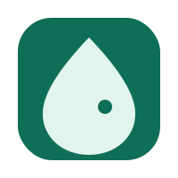
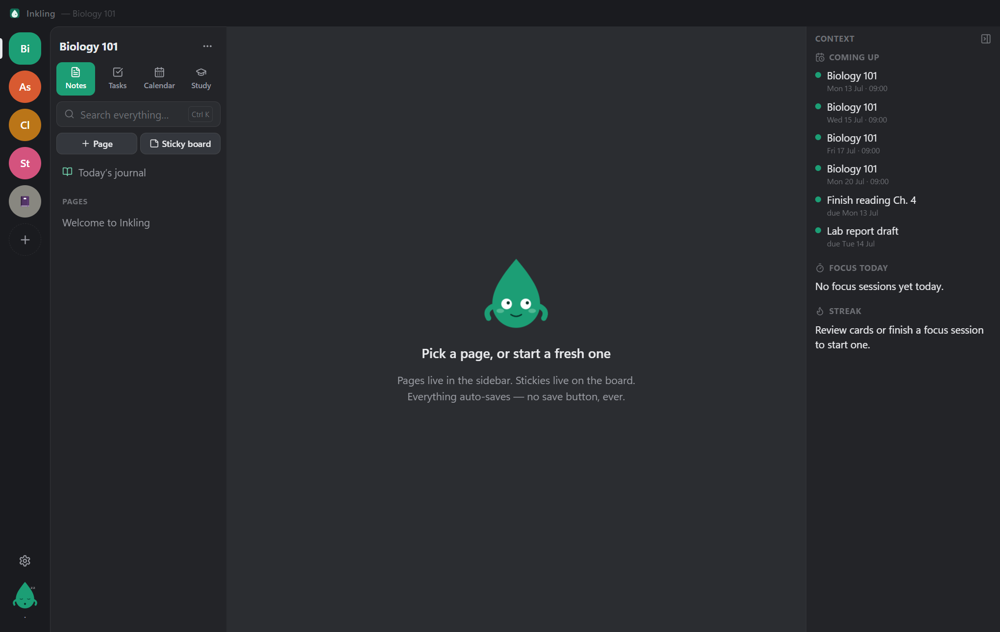
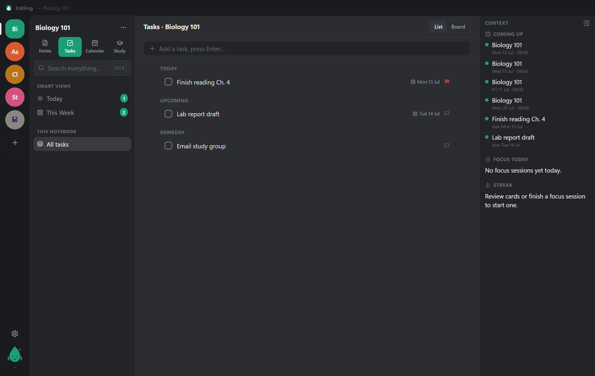
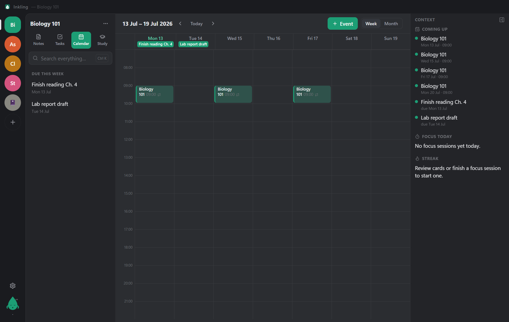
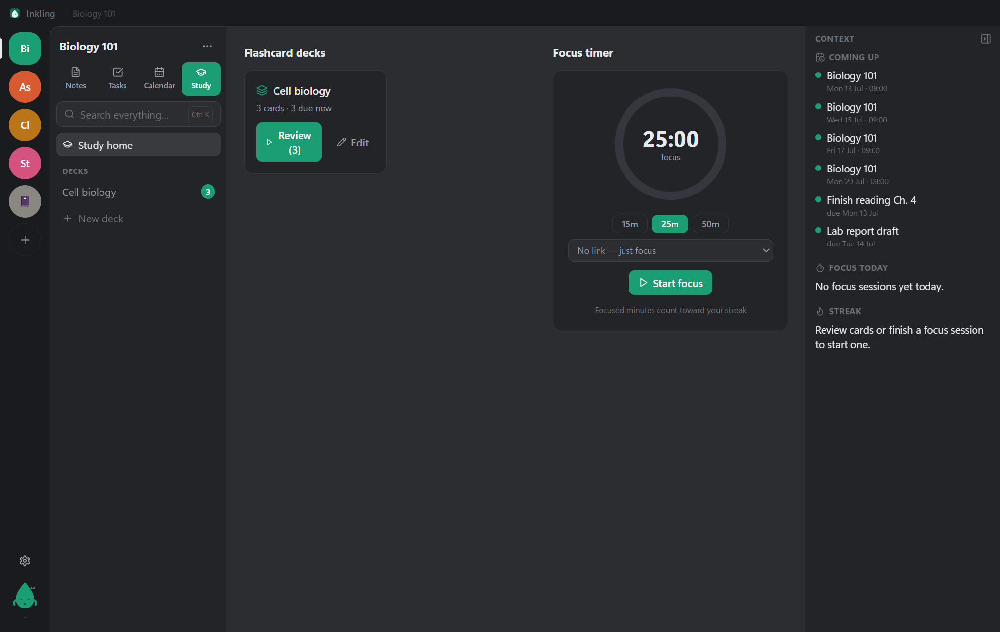

<div align="center">



# Inkling

### notes, tasks, schedule and study — together

A warm, local-first desktop hub where you can dump a quick thought, write a full essay, track assignments, see your week at a glance, and study for a test — all without leaving one app.

[](https://www.electronjs.org/)
[](https://react.dev/)
[](https://www.typescriptlang.org/)
[](https://tailwindcss.com/)
[](https://github.com/WiseLibs/better-sqlite3)
[](LICENSE)
[](#getting-started)

</div>

<p align="center">
  
</p>

---

## Why Inkling

Four things students and busy people juggle — **notes, tasks, a schedule, and studying** — usually live in four different apps that don't talk to each other. Inkling unifies them and cross-links them, so one piece of content flows everywhere:

> A page of *Chapter 4 notes* can hold a checkbox (`[] Finish reading by Friday`) that becomes a **real task**, which shows up on the **calendar**, while its `Term :: Definition` lines turn into **flashcards** — all from the same text, no duplicate entry.

- 🪶 **Zero friction to capture** — new note is one keystroke, no forced title, no save button
- 🧩 **One app, four pillars** — unified and cross-linked, not bolted-on separate tools
- 🔒 **Local-first** — everything works fully offline; your data is a single SQLite file on your machine
- ☕ **Friendly, not corporate** — warm *Cozy* theme, gentle empty states, an original mascot (Inky), zero dark patterns

---

## The four pillars

### 📝 Notes
TipTap rich-text **pages** (toolbar *and* live markdown shortcuts: `#`, `-`, `1.`, `>`, `**bold**`, `[]`) plus a freeform **sticky board** you can drag, resize, and recolor. Auto-saves as you type (debounced, flushed on blur).

### ✅ Tasks


List **and** kanban board, due dates, priorities, subtasks, and **Today / This Week** smart views that aggregate across every notebook. Typing `[]` in a note creates a real, bidirectionally-linked task.

### 📅 Calendar


Week and month grids with **recurring class blocks** (`WEEKLY;BYDAY=MO,WE,FR` — set once, repeats all semester). Task due-dates surface automatically, and you can **drag any event or task chip to reschedule** it.

### 📚 Study


**SM-2 spaced-repetition flashcards** (Again / Hard / Good / Easy, keys 1–4), one-click deck creation from `Term :: Definition` lines in a note, a **Pomodoro focus timer** linked to a task or deck, and a gentle, non-punishing **study streak**.

---

## Everything else

| | |
|---|---|
| 🔍 **Command palette** | `Ctrl+K` fuzzy search across notes, tasks, and decks (SQLite **FTS5**) + quick actions |
| ⚡ **Global quick-add** | `Ctrl+Alt+N` popup with natural-date detection — *“essay draft friday at 5pm”* |
| 🎨 **Themes** | Sleek **Dark** + warm **Cozy**, high-contrast mode, adjustable font size |
| 👋 **Onboarding** | 3-step first-launch flow with Inky; sensible starter notebooks for school/work/personal |
| 🐙 **Inky the mascot** | Original SVG character — idle bob, blink, cursor-tracking eyes, celebratory bounces |
| 💾 **Data safety** | WAL-mode SQLite with rolling local backups (last 5), crash-safe writes |
| 🛡️ **Secure by default** | `contextIsolation: true`, `nodeIntegration: false`, DB access only via the preload IPC bridge |

---

## Tech stack

| Layer | Choice |
|---|---|
| Shell | **Electron** (electron-vite) |
| UI | **React 18 + TypeScript** |
| Styling | **Tailwind CSS** + CSS variables |
| Editor | **TipTap** (ProseMirror) |
| State | **Zustand** (per-module stores) |
| Database | **better-sqlite3** + typed repositories, **FTS5** search |
| Drag & drop | **dnd-kit** (kanban) + hand-rolled pointer drags (calendar, sticky board) |
| Dates | **date-fns** |
| Spaced repetition | Custom **SM-2** implementation |
| Icons | **lucide-react** |
| Packaging | **electron-builder** (NSIS) |

---

## Getting started

Uses **[Bun](https://bun.sh)** as the package manager / script runner (npm works too). Electron runs the app on its own embedded Node — Bun just installs and orchestrates.

```bash
bun install     # also rebuilds better-sqlite3 for Electron (postinstall)
bun run dev     # dev mode with hot reload
```

Production build & launch:

```bash
bun run build
bunx electron .
```

Build the Windows installer (NSIS → `release/`):

```bash
bun run dist
```

> **Note:** `trustedDependencies` in `package.json` lets Bun run the postinstall scripts of `electron` (binary download) and `better-sqlite3` — don't remove it.

---

## Project layout

```
src/main       Electron main — db.ts (schema/backups), repos.ts (all queries, SM-2, FTS), ipc.ts, index.ts
src/preload    contextBridge → window.inkling (typed via src/shared/api.ts)
src/renderer   React app — stores/ (zustand), components/{shell,notes,tasks,calendar,study}, lib/
src/shared     types + API contract shared across processes
```

## Where's my data?

A single SQLite file (WAL mode) in `%APPDATA%/Inkling`, with a `backups/` folder beside it. Fully offline — nothing leaves your machine.

## Dev / test hooks

The main process reads a few env vars for isolated, reproducible runs:

| Variable | Effect |
|---|---|
| `INKLING_USERDATA=<dir>` | Run against an isolated profile |
| `INKLING_SEED=1` | Seed demo content on a fresh profile |
| `INKLING_SCREENSHOT=<file.png>` | Capture the window and exit |
| `INKLING_EVAL=<js>` | Run JS in the renderer before capture (`window.__app` exposes the store) |

---

## License

[MIT](LICENSE) © 2026 Dominik Könitzer
