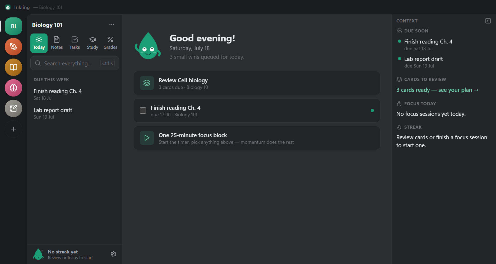
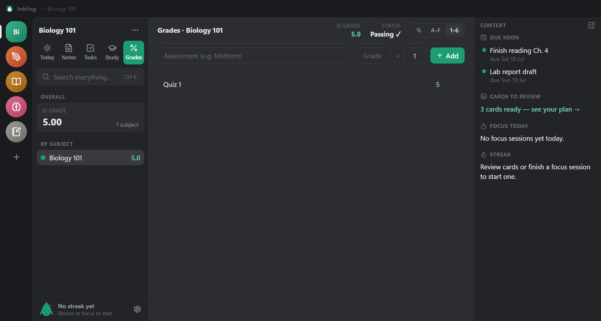

<div align="center">


<br />

[](https://github.com/dominikkoenitzer/Inkling/actions/workflows/ci.yml)
[](test)
[](https://www.electronjs.org/)
[](https://react.dev/)
[](https://www.typescriptlang.org/)
[](https://github.com/WiseLibs/better-sqlite3)
[](LICENSE)
[](https://github.com/dominikkoenitzer/Inkling/releases/latest)
[](https://github.com/dominikkoenitzer/Inkling/releases/latest)

**A warm, local-first desktop app that makes studying fun: open it and it tells you exactly what to do today — review these cards, finish that task, give your weakest subject some love.**

[Download](https://github.com/dominikkoenitzer/Inkling/releases/latest) · [Features](#the-five-modules) · [Getting started](#getting-started) · [Architecture](#project-layout)

</div>

<p align="center">
  
</p>

---

## Why Inkling

The hardest part of studying isn't the studying — it's knowing *what to do right now*. Inkling assembles a **daily plan** from things you already track (due flashcards, open tasks, your weakest subject) and cross-links everything, so one piece of content flows everywhere:

> A page of *Chapter 4 notes* can hold a checkbox (`[] Finish reading by Friday`) that becomes a **real task** in your **Today plan**, while its `Term :: Definition` lines turn into **flashcards** — all from the same text, no duplicate entry.

- ☀️ **A plan, not a blank page** — open the app and know exactly what to study today
- 🪶 **Zero friction to capture** — new note is one keystroke, no forced title, no save button
- 🔒 **Local-first** — everything works fully offline; your data is a single SQLite file on your machine
- ☕ **Friendly, not corporate** — warm *Cozy* theme, an original mascot (Inky), streaks and confetti, zero dark patterns

---

## The five modules

### ☀️ Today


An **auto-generated daily study plan**: due flashcard decks, tasks due today, your lowest-averaging subject, and a suggested focus block — each with a one-click start. Clear the plan, get confetti. That's the whole loop.

### 📝 Notes
TipTap rich-text **pages** (toolbar *and* live markdown shortcuts: `#`, `-`, `1.`, `>`, `**bold**`, `[]`) plus a freeform **sticky board** you can drag, resize, and recolor. Auto-saves as you type (debounced, flushed on blur).

### ✅ Tasks


List **and** kanban board, due dates, priorities, subtasks, and **Today / This Week** smart views that aggregate across every notebook. Typing `[]` in a note creates a real, bidirectionally-linked task.

### 📚 Study


**SM-2 spaced-repetition flashcards** (Again / Hard / Good / Easy, keys 1–4), one-click deck creation from `Term :: Definition` lines in a note, a **Pomodoro focus timer** linked to a task or deck, and a gentle, non-punishing **study streak**. The timer stays visible in the Discord-style **user bar** at the bottom of the sidebar, wherever you are in the app.

### 📊 Grades


Log assessments per subject and pick **your** grading system: **Swiss 1–6** (6 is best, 4 is a pass), **US letters + 4.0 GPA**, or plain **percentages**. Weighted averages per subject, an overall figure across subjects, and a "give this subject some love" nudge in your Today plan.

---

## Everything else

| | |
|---|---|
| 🔍 **Command palette** | `Ctrl+K` fuzzy search across notes, tasks, and decks (SQLite **FTS5**) + quick actions |
| ⚡ **Global quick-add** | `Ctrl+Alt+N` popup with natural-date detection — *“essay draft friday at 5pm”* |
| 🎨 **Themes** | Sleek **Dark** + warm **Cozy**, high-contrast mode, adjustable font size |
| 👋 **Onboarding** | 3-step first-launch flow with Inky; sensible starter notebooks for school/work/personal |
| 🐙 **Inky the mascot** | Original SVG character — idle bob, blink, cursor-tracking eyes, celebratory bounces |
| 🎛️ **User bar** | Discord-style panel at the bottom of the sidebar: Inky, your streak, a **live Pomodoro chip** (pause/resume anywhere), settings |
| 🏷️ **Notebook covers** | Every notebook gets a color **and** a monochrome icon glyph (flask, calculator, globe, …) shown on its Discord-style squircle |
| 💾 **Data safety** | WAL-mode SQLite with rolling local backups (last 5), crash-safe writes |
| 📤 **Export** | Turn any note — or a whole notebook — into portable **Markdown** (`.md`) or a print-styled **PDF** |
| 🔄 **Auto-update** | Packaged builds check GitHub Releases and update themselves (electron-updater) |
| 🛡️ **Secure by default** | `contextIsolation: true`, `nodeIntegration: false`, DB access only via the preload IPC bridge |

### Keyboard shortcuts

| Shortcut | Action |
|---|---|
| `Ctrl` + `K` | Command palette / search |
| `Ctrl` + `Alt` + `N` | Global quick-add popup |
| `Ctrl` + `,` | Settings |
| `#`, `-`, `1.`, `>`, `[]` | Markdown block shortcuts (in the editor) |
| `Ctrl` + `B` / `I` / `U` | Bold / italic / underline |
| `Space` then `1`–`4` | Reveal card, then grade (Again / Hard / Good / Easy) |

---

## Themes

Pick the sleek **Dark** theme or the warm **Cozy** one — with a high-contrast mode and adjustable font size on top.

| Dark | Cozy |
|:---:|:---:|
|  |  |

---

## Tech stack

| Layer | Choice |
|---|---|
| Shell | **Electron** (electron-vite) |
| UI | **React 18 + TypeScript** |
| Styling | **Tailwind CSS** + CSS variables |
| Editor | **TipTap** (ProseMirror) |
| State | **Zustand** (per-module stores) |
| Database | **better-sqlite3** + typed repositories, **FTS5** search |
| Drag & drop | **dnd-kit** (kanban) + hand-rolled pointer drags (sticky board) |
| Dates | **date-fns** |
| Spaced repetition | Custom **SM-2** implementation |
| Icons | **lucide-react** |
| Tests | **Vitest** (grade math, parsing, exporters, color-system logic) |
| CI / Packaging | **GitHub Actions** · **electron-builder** (NSIS) |

---

## Getting started

Uses **[Bun](https://bun.sh)** as the package manager / script runner (npm works too). Electron runs the app on its own embedded Node — Bun just installs and orchestrates.

```bash
bun install     # also rebuilds better-sqlite3 for Electron (postinstall)
bun run dev     # dev mode with hot reload
```

Everyday scripts:

```bash
bun run typecheck   # tsc across renderer + main/preload
bun run test        # vitest unit suite
bun run build       # production bundle
bun run dist        # Windows installer (NSIS) → release/
```

Prefer a prebuilt binary? Grab the latest installer for **Windows (`.exe`)**, **macOS (`.dmg`, universal — Intel + Apple Silicon)**, or **Linux (`.AppImage`)** from the [**Releases**](https://github.com/dominikkoenitzer/Inkling/releases/latest) page — each platform is built and attached automatically by the [release workflow](.github/workflows/release.yml).

> **Note:** `trustedDependencies` in `package.json` lets Bun run the postinstall scripts of `electron` (binary download) and `better-sqlite3` — don't remove it.

---

## Project layout

```
src/main       Electron main — db.ts (schema/backups), repos.ts (all queries, SM-2, FTS), ipc.ts, index.ts
src/preload    contextBridge → window.inkling (typed via src/shared/api.ts)
src/renderer   React app — stores/ (zustand), components/{shell,today,notes,tasks,study,grades}, lib/
src/shared     types + API contract shared across processes
test           Vitest suites for the pure logic (grades, parse, colors, exporters)
```

Data lives in a single WAL-mode SQLite file in `%APPDATA%/Inkling`, with a `backups/` folder beside it. Fully offline — nothing leaves your machine.

### Dev / test hooks

The main process reads a few env vars for isolated, reproducible runs:

| Variable | Effect |
|---|---|
| `INKLING_USERDATA=<dir>` | Run against an isolated profile |
| `INKLING_SEED=1` | Seed demo content on a fresh profile |
| `INKLING_SCREENSHOT=<file.png>` | Capture the window and exit |
| `INKLING_EVAL=<js>` | Run JS in the renderer before capture (`window.__app` exposes the store) |

---

## Roadmap

- [x] Four pillars, command palette, quick-add, themes, onboarding, mascot
- [x] SM-2 flashcards, Pomodoro, streak
- [x] CI + Windows, macOS & Linux installers (built automatically on release)
- [x] Markdown & PDF export (per note or whole notebook)
- [x] Grade tracker (weighted averages, letter grades, GPA)
- [x] Auto-update (electron-updater) + universal macOS build (Intel + Apple Silicon)
- [x] Today view (auto-generated daily study plan), grading systems (Swiss 1–6 / US / %), notebook icon covers, user bar
- [ ] Optional end-to-end-encrypted cloud sync
- [ ] Mobile companion

---

## Contributing

Issues and PRs welcome. Before opening a PR, please run:

```bash
bun run typecheck && bun run test && bun run build
```

See [`CHANGELOG.md`](CHANGELOG.md) for release history.

## License

[MIT](LICENSE) © 2026 Dominik Könitzer
